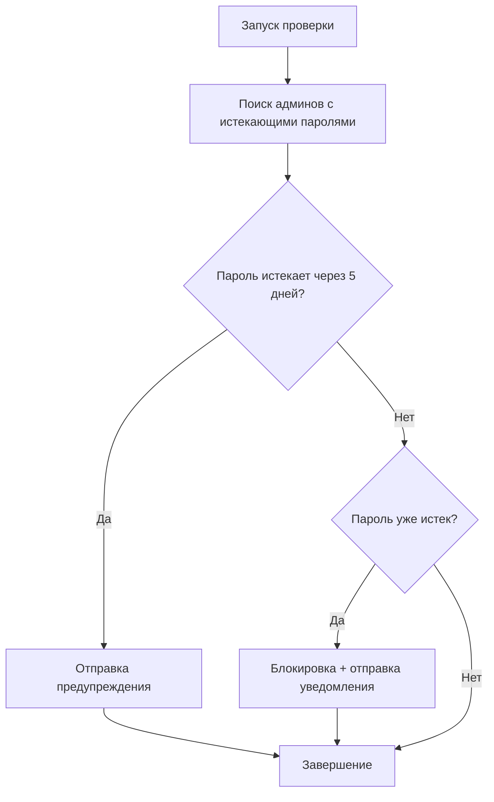
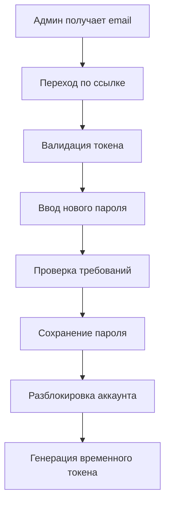

# 🔐 Система оповещения о истечении паролей администраторов

## 📋 Обзор

Автоматическая система для управления истечением паролей администраторов с оповещениями и принудительной сменой пароля.

## ⚙️ Функциональность

### 🔔 Автоматические уведомления

1. **Предупреждение за 5 дней** - Email с предупреждением о скором истечении пароля
2. **Принудительная смена** - Блокировка доступа и отправка ссылки для сброса пароля
3. **Ежедневная проверка** - Автоматическая проверка в 9:00 утра по московскому времени

### 🔒 Безопасность

-   Пароли действительны 90 дней (настраивается)
-   Принудительная блокировка при истечении
-   Безопасные токены для сброса пароля (24 часа)
-   Rate limiting на все операции

## 🚀 Установка и настройка

### 1. Запуск миграции

```bash
npm run migrate
```

### 2. Настройка переменных окружения

```env
# Настройки паролей
ADMIN_PASSWORD_EXPIRY_DAYS=90
ADMIN_MIN_PASSWORD_LENGTH=8

# Email настройки (для уведомлений)
SMTP_HOST=smtp.gmail.com
SMTP_PORT=587
SMTP_USER=your_email@gmail.com
SMTP_PASS=your_app_password
SMTP_FROM=noreply@nebulahunt.com
FRONTEND_URL=http://localhost:3000
```

### 3. Запуск cron job

Cron job автоматически запускается в production режиме:

```javascript
// Запускается каждый день в 9:00 утра
'0 9 * * *';
```

## 📧 Email шаблоны

### Предупреждение об истечении

-   **Шаблон**: `templates/password-expiry-warning.html`
-   **Отправляется**: За 5 дней до истечения
-   **Содержит**: Ссылку на смену пароля, рекомендации по безопасности

### Принудительная смена пароля

-   **Шаблон**: `templates/forced-password-change.html`
-   **Отправляется**: При истечении пароля
-   **Содержит**: Ссылку для сброса пароля, требования к новому паролю

## 🔧 API Endpoints

### Валидация токена сброса

```http
GET /api/admin/password-reset/validate/:token
```

**Ответ:**

```json
{
	"success": true,
	"message": "Token is valid",
	"data": {
		"adminId": 1,
		"email": "admin@example.com",
		"name": "Admin Name"
	}
}
```

### Сброс пароля

```http
POST /api/admin/password-reset/reset
Content-Type: application/json

{
  "token": "reset_token_here",
  "newPassword": "new_password123",
  "confirmPassword": "new_password123"
}
```

**Ответ:**

```json
{
	"success": true,
	"message": "Password reset successful",
	"data": {
		"temporaryToken": "temp_token_here",
		"expiresIn": "1 hour"
	}
}
```

### Повторная отправка уведомления

```http
POST /api/admin/password-reset/resend
Content-Type: application/json

{
  "email": "admin@example.com"
}
```

### Статус пароля

```http
GET /api/admin/password-reset/status/:adminId
```

**Ответ:**

```json
{
	"success": true,
	"data": {
		"isLocked": false,
		"passwordExpiresAt": "2024-12-31T23:59:59.000Z",
		"daysUntilExpiry": 45,
		"isExpired": false,
		"passwordExpiryNotified": false
	}
}
```

## 🧪 Тестирование

### Запуск тестов

```bash
# Полное тестирование системы
node test-password-expiry-system.js test

# Тестирование уведомлений
node test-password-expiry-system.js notifications

# Сброс тестовых данных
node test-password-expiry-system.js reset
```

### Ручная проверка

```bash
# Запуск проверки вручную
const { runManualCheck } = require('./jobs/password-expiry-checker');
await runManualCheck();
```

## 📊 Мониторинг

### Логи

Все операции логируются:

```javascript
// Примеры логов
logger.info('Starting password expiry check...');
logger.info('Expiry warning sent to admin admin@example.com');
logger.info(
	'Forced password change notification sent to admin admin@example.com'
);
logger.info('Password reset successful for admin 1');
```

### Метрики

Система предоставляет метрики для мониторинга:

-   Количество админов с истекающими паролями
-   Количество заблокированных аккаунтов
-   Успешные/неуспешные сбросы паролей

## 🔄 Процесс работы

### 1. Ежедневная проверка (9:00)



### 2. Процесс сброса пароля



## 🛡️ Безопасность

### Требования к паролю

-   Минимум 8 символов
-   Буквы и цифры
-   Не совпадает с предыдущими паролями

### Rate Limiting

-   Валидация токена: 5 попыток за 5 минут
-   Сброс пароля: 3 попытки за 10 минут
-   Повторная отправка: 2 попытки за 15 минут

### Токены

-   **Сброс пароля**: 24 часа
-   **Временный доступ**: 1 час
-   **JWT подпись**: JWT_ACCESS_SECRET

## 🐛 Troubleshooting

### Частые проблемы

1. **Email не отправляется**

    - Проверьте SMTP настройки
    - Убедитесь что FRONTEND_URL настроен правильно

2. **Cron job не запускается**

    - Проверьте NODE_ENV (должен быть production)
    - Проверьте логи на ошибки

3. **Токен недействителен**
    - Проверьте время (токен действителен 24 часа)
    - Убедитесь что JWT_ACCESS_SECRET настроен

### Логи для отладки

```bash
# Просмотр логов
tail -f logs/app.log | grep "password"

# Поиск ошибок
grep "ERROR.*password" logs/app.log
```

## 📝 Конфигурация

### Переменные окружения

| Переменная                   | Описание                    | По умолчанию |
| ---------------------------- | --------------------------- | ------------ |
| `ADMIN_PASSWORD_EXPIRY_DAYS` | Срок действия пароля в днях | 90           |
| `ADMIN_MIN_PASSWORD_LENGTH`  | Минимальная длина пароля    | 8            |
| `SMTP_HOST`                  | SMTP сервер                 | -            |
| `SMTP_PORT`                  | SMTP порт                   | 587          |
| `SMTP_USER`                  | SMTP пользователь           | -            |
| `SMTP_PASS`                  | SMTP пароль                 | -            |
| `FRONTEND_URL`               | URL фронтенда               | -            |

### Настройка времени проверки

Измените cron выражение в `jobs/password-expiry-checker.js`:

```javascript
// Каждый день в 9:00 утра
'0 9 * * *';

// Каждый день в 6:00 утра
'0 6 * * *';

// Каждые 12 часов
'0 */12 * * *';
```

## 🔗 Связанные файлы

-   `service/password-expiry-service.js` - Основная логика
-   `controllers/password-reset-controller.js` - API контроллер
-   `routes/password-reset-router.js` - API роуты
-   `jobs/password-expiry-checker.js` - Cron job
-   `utils/token-utils.js` - Утилиты для токенов
-   `templates/` - Email шаблоны
-   `migrations/20250101000012-add-password-expiry-fields.js` - Миграция БД
